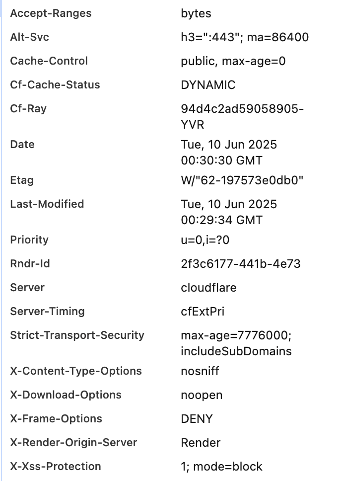

# HelmetJS

This repository enhances security by setting appropriate HTTP headers. 

## 📡 HTTP Security Headers Set

Below are the HTTP response headers set by Helmet, as seen in browser DevTools, along with their security purposes:

| **Header**                                                       | **Purpose**                                                |
|------------------------------------------------------------------|------------------------------------------------------------|
| `X-Frame-Options: DENY`                                          | Prevents clickjacking by disallowing the site to be embedded in `<iframe>` tags. |
| `X-Content-Type-Options: nosniff`                                | Prevents browsers from MIME-sniffing a response away from the declared content-type. |
| `X-XSS-Protection: 1; mode=block`                                | Enables legacy XSS protection in older browsers (e.g., IE). |
| `Strict-Transport-Security: max-age=7776000; includeSubDomains`  | Enforces HTTPS by telling the browser to only use secure connections for 90 days. |
| `Cache-Control: no-store, no-cache, must-revalidate`             | Prevents caching of sensitive data on the client side.     |
| `Pragma: no-cache`                                               | A legacy HTTP 1.0 header used in conjunction with `Cache-Control` to prevent caching. |
| `Surrogate-Control: no-store`                                    | Used to prevent intermediary caches (like CDNs) from storing the response. |
| `Content-Security-Policy: default-src 'self'; script-src 'self' trusted-cdn.com` | Limits the sources from which scripts and other resources can be loaded, mitigating XSS attacks. |

Below is the example of how it looks like with security headers:


## Project Structure
```
├── public/              
├── views/               
├── server.js            
├── app.js               # Security headers configuration with Helmet
└── README.md
```

## Credits
This project is based on Information Security course by freeCodeCamp.
You can find the original project instructions at:
https://www.freecodecamp.org/learn/information-security/#information-security-with-helmetjs